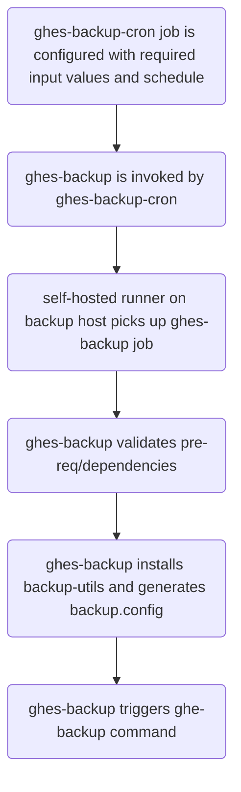

# GitHub Enterprise Server Backup with GitHub Actions

*Notice*: The contents of this repository are meant for reference example only and should not directly be used in a production environment without additional testing and validation.

## Overview

This repository serves as an example for configuring [GitHub Enterprise Server Backup Utilities](https://github.com/github/backup-utils) to be executed using GitHub Actions.

This example is intended to be used by GitHub Enterprise Server(GHES) administrators who are looking to add additional visibility or notifications to scheduled backup runs where only `crontab` might be used currently by using GitHub Actions to execute the scheduled backup for logging and notifications.

## Components

This example repository contains two GitHub Actions workflows.

### Components - ghes-backup

Configuration contained in [ghes-backup.yml](.github/workflows/ghes-backup.yml) is set to use only a `workflow_call` trigger to execute a backup job with provided inputs.

- `inputs`: There are a number of inputs created for this workflow which match to the values available for configuration in a `backup.config` file for [backup-utils](https://github.com/github/backup-utils) for executing `ghe-backup`.
- `runs-on`: The `backup` job has a `runs-on` block which defaults in this example to a value of `ghes-backup-runner`.  This value should be the label which is setup for the GitHub Actions runner which resides on the `backup-utils` backup host.
- `timeout-minutes`: A realistic timeout value for the backup job should be set here (23 hours in this example).

### Components - ghes-backup-cron

Configuration contained in [ghes-backup-cron.yml](.github/workflows/ghes-backup-cron.yml) is set to invoke the `ghes-backup` workflow on a `schedule` or via manual `workflow_dispatch`.  Inputs are populated using `with:` for calling `ghes-backup` to specify parameters for the job's run-time.

## Usage

Usage of this example requires a GHES installation and all of the [requirements specified for backup-utils](https://github.com/github/backup-utils/blob/master/docs/requirements.md).

A [self-hosted runner](https://docs.github.com/en/actions/hosting-your-own-runners/about-self-hosted-runners) is configured on the backup host and is called by the [ghes-backup](./.github/workflows/ghes-backup.yml) workflow.  This self-hosted runner should be [repository-scoped](https://docs.github.com/en/actions/hosting-your-own-runners/adding-self-hosted-runners#adding-a-self-hosted-runner-to-a-repository) only and this repository should be marked as `private` with only necessary members provided access.

The `backup.config` file used for execution during `ghes-backup` is created on job run using provided inputs from the `ghes-backup-cron` workflow.  This file is created during run time to make sure that all config options match what is setup in this repository for execution.

The `ghes-backup` workflow currently assumes that the system account which spawned the GitHub Actions runner process has the necessary SSH identity configuration files in place.

